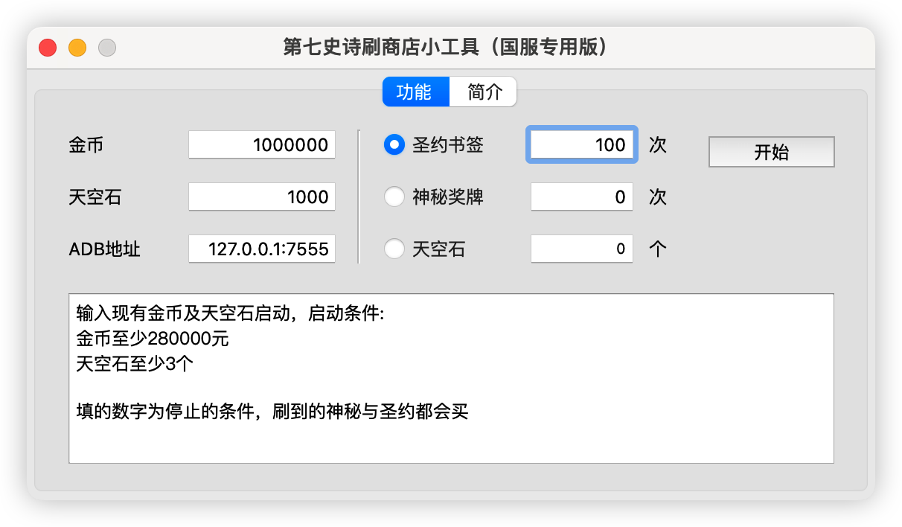

# epic7auto
### 第七史诗国服专用自动刷商店脚本

特别感谢原项目[epic7autoBookmark](https://github.com/steven010116/epic7autoBookmark)，由于原项目在国服无法正常使用，在其基础上魔改出这一版

### 更新日志：
2023.7.4：更新adb连接地址输入框，以适配更多模拟器及多开情况，exe文件尚未更新，可自行根据源代码进行编译打包

## ！！！仅在MUMU模拟器完成测试！！！
## 其他模拟器原则上分辨率不变的情况下也适配，遇到无法使用的请提交issue，注意其他模拟器的adb端口可能不同

1、找到mumu模拟器安装目录，执行命令adb.exe kill-server，再执行命令adb.exe connect 127.0.0.1:7555

2、mumu模拟器分辨率设置为平板模式1920*1080

3、游戏设置中把普通设置中下面的选项全部取消勾选

4、进入商店页面，输入当前的金币数及天空石数，点击开始运行脚本

